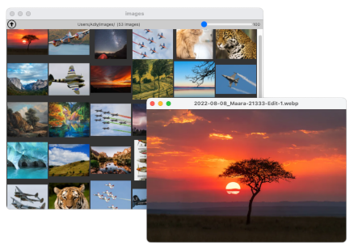

#  Piq

Simple cross-platform image browser

- Clean UI, no clutter.
- Very fast thumbnail generator (thanks to [sharp#](https://sharp.pixelplumbing.com/)).
- Supports common image files: **jpeg**, **png**, **webp**, **svg**, **gif**, **avif**

## Download

Packages are available for Mac OS and Linux:

[ Latest Release](releases/latest)

